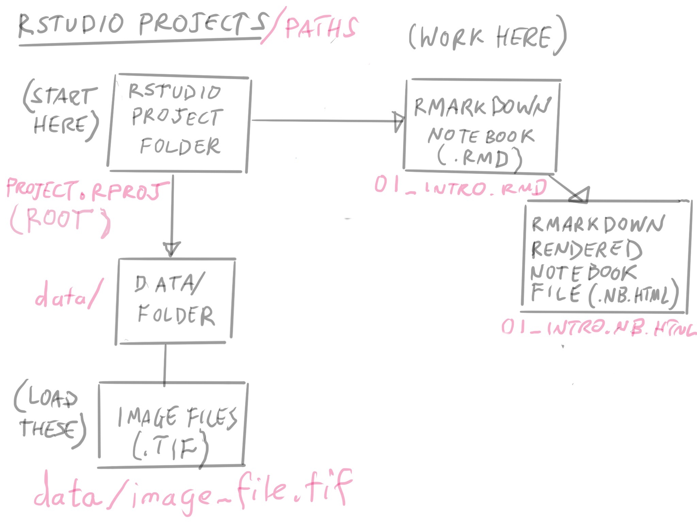
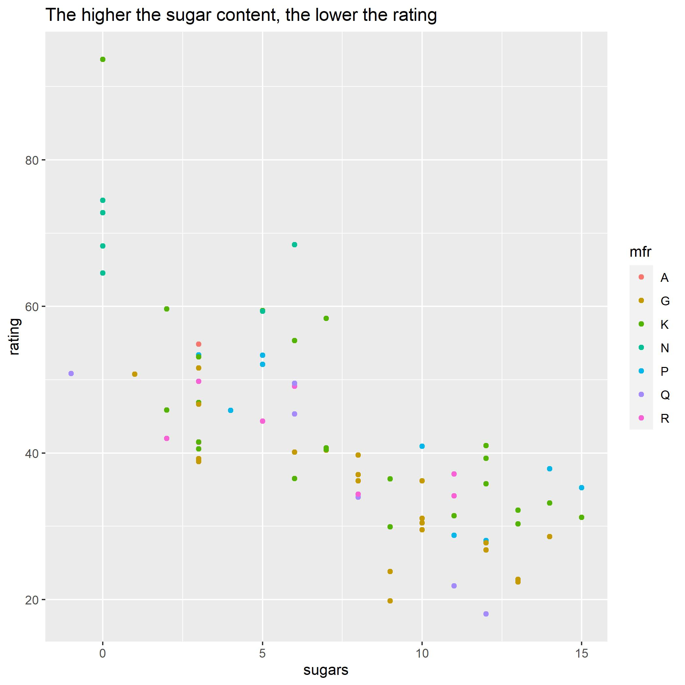
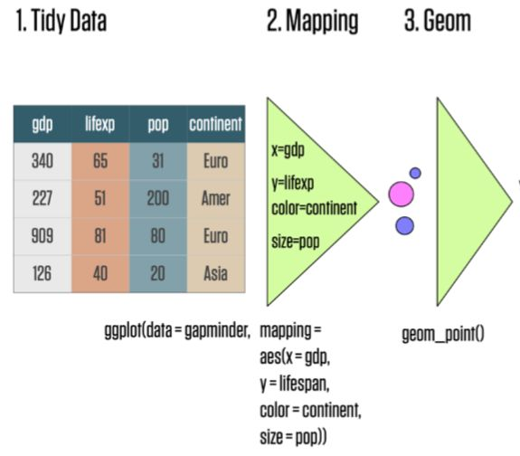

```{r setup, include=FALSE}
knitr::opts_chunk$set(echo = TRUE)
library(vembedr)
library(tidyverse)
library(readxl)

```

# Welcome to the Short Course!

## Before you get started

Remember to save this notebook under a new name, such as `part1_laderas.Rmd`.

# Learning Objectives

By the end of this session, you should be able to:

1.  **Import** spreadsheet-style data into R as a `data.frame`.
2.  **Visualize** `numeric` vectors in this dataset using `ggplot2`
3.  **Visualize** categorical/numeric variables as `boxplots`
4.  **Customize** your plot using `theme()`
5.  **Change** colors and breaks using `{scales}`

## A note about Base R versus the Tidyverse

In this course, we'll be focusing on using functions from the [tidyverse](https://www.tidyverse.org/).

It is set up as a *library* - functions someone else wrote that are not built into R. We'll use quite a few libraries in this course.

The Tidyverse is essentially a library of libraries -- each of these libraries contains functions that are either essential for or *greatly* simplify the process of data manipulation and visualization for data scientists.

We have already installed the `tidyverse` for you in Rstudio.cloud. For reading excel files, we also need to load up an additional library called `readxl`.

```{r warning=F, message=FALSE}
#load the required libraries

library(tidyverse)
library(readxl)
```

## Importing spreadsheet-style data into R

```{r}

```

Once you have your notebook open, let's talk about its location. It is located where the `project.rproj` file. The location of this file (also called an "RProject" file) is always considered the `root` directory of the project.

It's where you start from that determines the file directory path for loading data.

Since this notebook, `part1.Rmd` is in the same folder as the `project.rproj` file, then when we need to refer to data files, it is *relative* to the root folder.

When you're starting out, it's best to keep your RMarkdown notebooks and files in the **root** folder. It will help prevent you from dealing with a lot of headaches.

## A good place to put your data

Take a look at the `data/` folder, and where the `cereal.xlsx` file is.

In our notebook, how do we refer to that file name? Since we're in the root, we can refer to it as

`data/cereal.xlsx`

## Loading our excel file

Now we can use a built-in function called `read_excel()` that will help us load our data into R:

```{r}
cereals <- read_excel("data/cereal.xlsx",
                     sheet = 1,
                     na = "NA")
```

You should see `cereals` appear in the Environment window on the upper right panel in RStudio. If you click on `cereals` there, a new tab will appear next to your R script in the Source window.

> Clicking on the name of an object in the Environment window is a shortcut for running `View(cereals)`; you'll see this code appear in the Console after clicking.

## Notes on the Data

Dataset Link: <https://www.kaggle.com/crawford/80-cereals>

Fields in the dataset:

-   `Name`: Name of cereal

-   `mfr`: Manufacturer of cereal

    -   A = American Home Food Products;
    -   G = General Mills
    -   K = Kelloggs
    -   N = Nabisco
    -   P = Post
    -   Q = Quaker Oats
    -   R = Ralston Purina

-   `type`:

    -   cold
    -   hot

-   `calories`: calories per serving

-   `protein`: grams of protein

-   `fat`: grams of fat

-   `sodium`: milligrams of sodium

-   `fiber`: grams of dietary fiber

-   `carbo`: grams of complex carbohydrates

-   `sugars`: grams of sugars

-   `potass`: milligrams of potassium

-   `vitamins`: vitamins and minerals - 0, 25, or 100, indicating the typical percentage of FDA recommended

-   `shelf`: display shelf (1, 2, or 3, counting from the floor)

-   `weight`: weight in ounces of one serving

-   `cups`: number of cups in one serving

-   `rating`: a rating of the cereals (Possibly from Consumer Reports?)

## Introducing `ggplot2`

Click the button below to load up the graphic.

```{r}
knitr::include_graphics("image/ggplot2_exploratory.png")

```

Now that we've loaded our data as a `data.frame`, we can begin to start doing things with it.

Let's start with visualizing the data.

## Working Towards a Graph

We're going to work towards the following graph today:

```{r}

```

Here's a visual summary of the different parts we're talking about today.

```{r}

```

Image from Kieran Healy

## `ggplot2`: A Grammar of Graphics

`ggplot2` is an extremely powerful software library for visualization.

The `gg` is short for Grammar of Graphics, which means that visualizations are expressed in a very specific way.

## Learning to read `ggplot2` code

A `ggplot2` graphic consists of a:

-   `mapping` of variables in `data` to
-   `aes()`thetic attributes of
-   `geom_`etric objects.

In code, this is translated as:

    #start the plot with ggplot()

    ggplot(data = cereals) +   


    # make the mapping
    # map the x-axis to sugar
    # map the y-axis to rating

          aes(
              x = sugar, 
              y = rating 
              ) +

    # add the geometry
      geom_point()

Things to note: we chain these three things together with `+` (plus sign). I tend to read the plus as `then`.

[aes() function - mapping variables to visual properties of the graph]

## Challenge

Based on the `sugar` versus `rating` graph above, map the appropriate variables in `cereals` to the x, and y aesthetics. Run your plot. Is it what you expected?

What's missing compared to the graph above?

```{r}
ggplot(data = cereals) +

  aes(x = _____ ,
      y = _____ ) +
  
  geom_point()
```

## Answer

```{r}
ggplot(data = cereals) +

  aes(x = sugars ,
      y = rating ) +
  
  geom_point()
```

## Color

We can also map a `character` variable to our graph to color.

Try mapping `mfr` to `color`.

```{r}
ggplot(data = cereals) +

  aes(x = sugars,
      y = rating,  
      color = mfr) +
  
  geom_point() 
```

## Titles

We can add more details to our graph. We can add a title using the `labs()` function:

```{r}
ggplot(data = cereals) +

  aes(x = sugars,
      y = rating,  
      color = mfr) +
  
  geom_point() +
  
  labs(title="The higher the sugar content, the lower the rating") 

```

## Changing the Axis Labels

We can change the x-axis titles and the y-axis titles using the `xlab()` (short for x label) and `ylab()` functions:

```{r}
ggplot(data = cereals) +

  aes(x = sugars ,
      y = rating,  
      color = mfr) +
  
  geom_point() +
  
  ggtitle("The higher the sugar content, the lower the rating") +
  
  xlab("Sugar content (g)") + 
  
  ylab("Days to Follow Up")

```

Now we've re-created the above plot! Let's save it using `ggsave()`. `ggsave()` saves the last created plot to a file. We'll save it as a `jpg` file. `ggsave()` is smart enough to know that we want to save it as a `jpg` from adding the extension `.jpg` to our filename.

```{r}
ggsave("sugar-plot.jpg")
```

## Customizing our Scatterplot

Now that we have the data generally displayed the way we'd like, we can start to customize a plot. Let's assign our plot as an object named `our_plot`:

```{r}
our_plot <- ggplot(data = cereals) +

  aes(x = sugars,
      y = rating,  
      color = mfr) +
  
  geom_point() +
  
  ggtitle("The higher the sugar content, the lower the rating") +
  
  xlab("Sugar content (g)") + 
  
  ylab("Days to Follow Up")
```

# Changing visual properties using built in themes

```{r}
our_plot +
  theme_minimal()
```

A complete list of pre-set themes is available [here](https://ggplot2.tidyverse.org/reference/ggtheme.html), and we'll cover ways to customize our own themes later in this lesson.

### Using `theme()` to customize

Adding the `theme()` function will let us customize our plot further.

There are a few arguments that are really helpful to modify:

-   `axis.title`
-   `axis.title.x` (label for the x-axis)
-   `axis.title.y` (label for the y-axis)
-   `legend.position` (Placing the legend, including removing it)

```{r}
our_plot + 
  theme_bw() +
  theme(axis.text.x = element_text(angle = 90))
```

```{r}
our_plot + 
  theme_bw() +
  theme(legend.position = "none")
```

## Saving your work

After you're satisfied with a plot, it's likely you'd want to share it with other people or include in a manuscript or report.

```{r save}
# save plot to file
ggsave("awesomePlot.jpg", width = 10, height = 10, dpi = 300)
```

This automatically saves the last plot for which code was executed. This command interprets the file format for export using the file suffix you specify. The other arguments dictate the size (`width` and `height`) and resolution (`dpi`).

## Boxplots

Boxplots compare the distribution of a quantitative variable among categories.

Remember, `mfr` is a `character` vector, but we're not too worried about the implicit order of the categories, so we can use it as is in our boxplot.

```{r box}
# creating a boxplot

ggplot(cereals) +
  
  aes(x = mfr, y = rating) +
  
  geom_boxplot()
```

The main differences from the scatterplots we created earlier are the `geom` type and the variables plotted.

We can change the color similarly to scatterplots. However, we map to `fill` and not `color`:

```{r box_color}
# adding color
our_boxplot <- ggplot(cereals) +
  aes(x = mfr, y = rating, fill = mfr) +
  geom_boxplot()

our_boxplot
```

## Faceting our boxplot

One of the most powerful ways to change a visualization is by *faceting*. We can make multiple plots using another categorical variable.

To do this, we have to add the `facet_wrap()` command to our plot. We need to specify the variable to `facet_wrap` - `mfr` by using the `vars()` function to specify it as a variable.

```{r box_color}
# adding color
our_boxplot +
  
  facet_wrap(vars(type))
```

Don't try to facet on a `numeric` variable - it won't work.

Don't forget to look at the help documentation (e.g., `?facet_wrap`) to learn more about additional ways to customize your plots!

### Challenge

Facet the boxplot by `shelf`. Don't forget `vars()!`

```{r}
ggplot(cereals) +
  
  aes(x = mfr, 
      y = rating, 
      fill = mfr) +
  
  geom_boxplot() +
  
  facet_wrap(vars(factor(------)))

```

## `geom`s are layers on your plot

The really neat thing about `geom`s are that they can be layered onto your plot.

Here we're layering another geom, `geom_violin()` on `geom_boxplot()`.

We're providing a couple of values to `geom_violin()`:

-   `alpha`, which controls the transparency of the geom
-   `width`, which controls the overall width of the violins.

```{r}
our_boxplot <- ggplot(cereals) +
    aes(y = rating, x=mfr, fill=mfr) +
    geom_boxplot() +
    geom_violin(alpha = 0.5, width = 0.5)
    
our_boxplot
```

## Scales

Scales are added to a ggplot for multiple reasons:

-   Transform numerical axes (such as change a plot to a log scale)
-   Change the breaks (tick values) in a plot
-   Format values in a scale (such as dollars: "\$500", "600")
-   Map discrete values to particular colors (make "LUSC" = "blue")

All scale functions begin with `scale_` and are followed by the `aesthetic` it's working on, and the `transformation` of the data.

For example:

## Changing axis ticks and values using `scale_x_continuous()`

One main use for `scale_` functions is to modify the *breaks* (the tick values along an axis):

Here we're providing `scale_x_continuous()` an argument called `breaks`, which is a numeric vector that specifies the values we want each tick to be at:

```{r}
our_plot <- ggplot(cereals) +

  aes(x = sugars, 
      y = rating, 
      color = mfr) +
  
  geom_point(alpha = 0.5) +
  
  labs(title = "Cigarettes per Day versus Age at Diagnosis",
       x = "Age at Diagnosis",
       y = "Cigarettes Smoked per Day") + 

  scale_x_continuous(breaks = c(0, 5, 10, 15))
  
our_plot
```

### Your Turn

How would you modify the `y` axis to have the following breaks?

c(2, 4, 6, 8, 10)

Hint: it's not `scale_x_continuous`, but `scale_y_continuous`:

```{r}
our_plot +
  
    scale_y_continous()

```

## Better Labels

The other main use for `scale_` functions is to improve the formatting on the axis tick labels.

Say our y axis was dollars instead of number of cigarettes. We can supply `label_dollar()` as an argument to our `labels` argument in scale\_y\_continuous:

```{r}
our_plot +
    scale_y_continuous(labels = scales::label_dollar())
```

Other useful label\_ functions for formatting labels:

-   `label_date()` - Lets you control the way dates are formatted on the axis
-   `label_scientific()` - lets you format the labels with scientific notation
-   `label_pvalue()` - formatting specific to p-values

## scale\_color\_manual() - mapping discrete colors to categories

If you want to customize the colors values in your data set are mapped to, you can use `scale_color_manual()`:

```{r}
our_plot +
    scale_color_manual(values = c("C" = "limegreen", 
                                  "H" = "orange"))

```

## Color Palettes: `{wesanderson}`

If you don't want to meticulously control every color, you can use palettes as a starting point for your

```{r}
library(wesanderson)

names(wes_palettes)
```

```{r}
wes_palette("IsleofDogs1")
```

[to fix]

```{r}
our_plot +
    scale_color_manual(values = wes_palette("IsleofDogs1"))

```

Remember, if we want to do this with `our_boxplot`, the scale we want to manipulate is not `color`, but `fill`, so we need to use `scale_fill_manual()`

```{r}
our_boxplot +
    scale_fill_manual(values = wes_palette("IsleofDogs1"))

```

### Your Turn

Pick one of the palettes from `wesanderson` and use it to modify `our_plot`:

```{r}

our_plot +
    scale_color_manual(values = __________)
```

## `scale_color_gradient()`

We've talked about variables with discrete values, but what about variables with continuous values?

```{r}
ggplot(cereals) +

  aes(x = sugars, 
      y = rating, 
      color = fat) +
  
  geom_point(alpha = 0.5) +
  
  labs(title = "Sugar (grams)",
       x = "Age at Diagnosis",
       y = "Cigarettes Smoked per Day") +
  
  scale_color_gradient(low = "black", high="blue")


```

## Color Palettes: `{viridisLite}`

One really important package to know about is `{viridisLite}`, which contains a number of color-blind friendly palettes.

They have built in functions that use these:

For discrete values:

-   `scale_color_viridis_d()`
-   `scale_fill_viridis_d()`

For continuous values:

-   `scale_color_viridis_c()`
-   `scale_fill_viridis_c()`

```{r}
library(viridisLite)

our_plot +
  theme_minimal() +
  scale_color_viridis_d()
```

# More Palettes

The `{paleteer}` package has a lot of other palettes:

<https://emilhvitfeldt.github.io/paletteer/>

## Further learning

If you are interested in learning more about ggplot: - Documentation for all `ggplot` features is available [here](https://ggplot2.tidyverse.org). - RStudio also publishes a [ggplot cheat sheet](https://github.com/rstudio/cheatsheets/raw/master/data-visualization-2.1.pdf) that is really handy! - [Customizing ggplot2 Cheatsheet](http://zevross.com/blog/2014/08/04/beautiful-plotting-in-r-a-ggplot2-cheatsheet-3/) is also handy, because it organizes ggplot2 commands by task.
