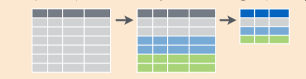

```{r setup, include=FALSE}
knitr::opts_chunk$set(echo = TRUE)
```

# Before You Get Started

Make sure to set the code window to visual mode and to save a copy of this under your own name.

# Learning Objectives

-   **List** 5 key `{dplyr}` verbs for data manipulation
-   **Sort** a dataset by columns using `arrange()`
-   **Utilize** the pipe (`%>%`) to chain `{dplyr}` verbs together.
-   **Select** columns from a dataset using `select()`
-   **Learn** and apply `mutate()` to change the data type of a variable
-   **Apply** `mutate()` to calculate a new variable based on other variables in a `data.frame`.
-   **Apply** `case_when` in a `mutate()` statement to make a continuous variable categorical
-   **Apply** `group_by()/summarize()` as a pattern to get summary statistics, including counts, means, and standard deviations within a category.
-   **Standardize** variable names using `clean_names()`

## Getting Set up

```{r prep, message=FALSE, warning=FALSE}
# load libraries
library(tidyverse)
library(readxl)
library(janitor)

cereals <- read_excel("data/cereal.xlsx", 
                             sheet=1, 
                             na="NA")
```

# Before we get started

I want to point you to the dplyr cheatsheet: <https://www.rstudio.com/wp-content/uploads/2015/02/data-wrangling-cheatsheet.pdf>

This is probably the most useful reference to `{dplyr}` that you will need for the time being.

# Data Manipulation using `dplyr`

```{r}
knitr::include_graphics("image/dplyr_wrangling.png")
```

What we have learned is so far is pretty great overall for plotting. But there are a lot of other things we can do with `data.frame`s!

We're going to talk about another tidyverse package: `dplyr`. `dplyr` is your all-purpose toolbox for filtering, summarizing, and transforming data.

The nice thing about `dplyr` is that it is focused on verbs that do things to your data.

We'll focus on the following verbs:

-   `arrange()` - sorting a `data.frame` by a variable
-   `filter()` - subsetting a `data.frame` by criteria
-   `select()` - returning only a few columns from our `data.frame`
-   `group_by()/summarize()` - summarizing our data.frame, such as counting and computing means
-   `mutate()` - transforming variables in our data
-   `%>%` - the pipe character, which lets us join our verbs together in a *pipeline*.

## Introducing the pipe (`%>%`)

Often times, we want to do multiple operations on our data and in a specific order.

For example, I might want to do the following:

-   *Take* my dataset `cereals` **and then**

-   *Sort* it by `fat` **and then**

-   *filter* to have only cereals from Nabisco from the data.

The pipe (`%>%`) function acts like the **and then**:

```{r}
# Take my dataset smoke complete **and then**
cereals %>%
  
#sort it by cigarettes_per day **and then**
  arrange(fat) %>%

#filter it to only have cereals manufactured by Nabisco
  filter(mfr == "N")

```

You can think of a pipe as putting the output of one step as an input of another. These two statements are equivalent:

```{r}
cereals %>%
  arrange(fat)
```

and

```{r}
arrange(cereals, fat)
```

## Why pipes?

Pipes make it easier to put together commands.

Without pipes, I'd have to do the following:

```{r}
arrange(
  filter(cereals, 
         mfr == "N"),
  fat
)
```

You can see that as you add more and more verbs, it gets more and more complicated. That's what pipes are supposed to save us from.

## One Step at a Time

One big advantage of the pipe is that you can build your processing line by line.

In practice, as I work, I will often pipe things into `View()` to confirm I did things correctly:

```{r eval = FALSE}
cereals %>%
  arrange(fat) %>%
  View()
```

This is a good way to work. By building each step and verifying that the output is correct, we can build really long *pipelines* of processing.

## The difference between `+` and `%>%`

Remember that `+` is for `ggplot2` and that `%>%` is for `dplyr`. To keep them distinct and avoid confusion, separate our your data processing and your plotting.

You can chain them, but I always find that I get confused when I go back and alter the code.

```{r}
filtered_cereals <- cereals %>%
  filter(mfr == "N")

ggplot(data=filtered_cereals) +
  aes(x = fat) +
  geom_histogram()
```

## A Note on the new R-native pipe (`|>`)

The pipe we've been using is part of the `{magrittr}` package. As of R 4.0, there is a new pipe that is native to R, which uses the `|>` characters instead of `%>%`:

```{r}
filtered_cereals <- cereals |>
  filter(mfr == "N")

ggplot(data=filtered_cereals) +
  aes(x = fat) +
  geom_histogram()
```

The native pipe does have better performance overall. I haven't switched my code over yet.


## Sorting Data Frames using `arrange()`

Ok, let's look at `arrange()`. It's a function that lets us sort a `data.frame` by a variable.

By default, it sorts in *ascending* order:

```{r}
cereals %>% 
  arrange(sugars)
```

To sort by descending order, you need to wrap the variable in the `desc()` function:

```{r}
cereals %>%
  arrange(desc(sugars))
```

You can also arrange by multiple variables.

```{r}
smoke_complete %>%
  arrange(desc(sugars),
          fat)
```

Note that order of variables in `arrange()` matters!

```{r}
smoke_complete %>%
  arrange(
    fat,
    desc(sugars)
          )
```

### Challenge

Use `arrange()` to sort by `rating` and by descending `sugars`.

```{r}
smoke_complete %>%
  arrange(-----, desc(-----))
```

## `filter()`ing our data

```{r}

```

`filter()` is an extremely powerful function. It lets us subset our data according to specific criteria.

Let's filter on a `numeric` variable, `cigarettes_per_day`:

```{r}
cereals %>%
  filter(fat < 3)

```

We can also filter on a category. But that does require us to know the values of that categorical variable.

```{r}
cereals %>%
  filter(mfr == "C")
```

## Filtering requires a little logic

We can chain multiple criteria using the `&` (AND) or `|` (OR) operators. But we need to review a little logic before we do this.

If I wanted to return cereals who are

manufactured by `N` **and** have shelf level `1`,

I would want use an `&` to chain these criteria together:

    mfr == "N" & shelf == 1

```{r}
cereals %>%
  filter(mfr == "N" & shelf == 1)

```

If I wanted cereals which are

`N` **or** shelf 1

I would use an `|` to chain these criteria together.

```{r}
cereals %>%
 filter(mfr == "N" | shelf == 1)
```

Think about it: which of the above two code blocks will return a larger number of patients?

### How do I know what values exist in a categorical variable?

We've already seen both `skim()` and `glimpse()` can give us an idea of what values exist in a categorical variable.

We can use `distinct()` to grab all of the unique values for a categorical variable, and then use `arrange()` to get at them.

```{r}
cereals %>%
  distinct(mfr) %>%
  arrange(mfr)
```

This can also alert us if there are categorical coding mistakes (such as misspellings) in our data.

Another tidy way to do this is to use the `tabyl()` function from the {janitor} package:

```{r}
library(janitor)

cereals %>%
  tabyl(mfr)
```

### Challenge

Use `filter()` to select cereals who have

mfr == "C" **and**

who have less than 100 mg sodium.

```{r}
smoke_complete %>%
  filter()
```

## More about Comparison and Logical Operators

This is a useful reference for all the different operators (both logical and comparison) that you can use: <https://www.datamentor.io/r-programming/operator/>

# `mutate()` - A confusing name, a powerful `dplyr` verb

```{r}
knitr::include_graphics("image/dplyr_mutate.png")
```

So what is mutate? `mutate()` is one of the most useful `dplyr` verbs. You can use it to transform data (variables in your `data.frame`) and add it as a new variable into the data.frame.

```{r}

```

I tend to think of this much like adding a formula in Excel to calculate the value of a new column based on previous columns. You can do lots of things such as:

-   subtract one column from another
-   convert the units of one column to new units (such as days to years)
-   change the capitalization of categories in a variable
-   recode a continuous variable to be a categorical one

## Using `mutate` to calculate a new variable based on other variables

One use for `mutate` is to do Excel type calculations using other columns on the data. For instance, we might want to calculate the sum of `age_at_diagnoses`and `days_to_death` to get the `age_at_death`.

```{r}
cereals %>% 
    mutate(fat_and_sugar_calories = 4*sugars + fat*9) 
```

## Your Turn

Create a variable called `fat_calories` by multiplying `fat` by `9` below:

```{r}
cereals %>%
    mutate(fat_calories = -------) 

```

## Using `mutate` to make our `character` variables into `factors`

Remember `factor`s? Well, we can use `mutate()` to make a `character` variable a `factor`.

Let's convert `type` from `character` into `factor`. We'll then pipe the output into `glimpse()` so you can see the variable types.

```{r}
cereals %>% 
    #reassign the type variable to be a factor
    mutate(type = factor(type)) %>%
    glimpse()
```

One thing to notice: we are doing something called *reassignment* here. We're taking the previous values of our variable (`type`), doing something to it (making it a `factor`), and then reassigning the variable `type` to our fixed set of values.

Remember when we wanted to decide the order of the categories in the factor? We can assign that order using the `levels` argument in `factor()`. To show the order, we can pipe the output into a command called `tabyl()`, from the `janitor` package, which is a `tidyverse` friendly version of `table()`.

```{r}
cereals %>% 
    #reassign the type variable to be a factor
    mutate(type = ordered(type, levels = c("H", "C"))) %>%
    tabyl(type)
```

Notice that the `C` value goes before the `H`, which is what we wanted.

```{r}
library(visdat)

vis_dat(cereals)

```

## Using `mutate` to replace missing values with `replace_na`

Sometimes we want to fill in missing values with a certain value. We can use the `replace_na()` function inside of `mutate()` to specify this. For example, if the days to last follow up is missing, we want to set their days to follow up to 0. The first two observations in this data have missing follow up, but when we replace them we note they are now equal to 0:

```{r}
cereals %>%
    mutate(sodium = replace_na(sodium, 0)) %>%
    glimpse()
```

## Using `mutate` to make a continuous variable categorical using `case_when`

Say we want to make `fat` into a categorical variable called `fat_category` with the values:

-   Low: 0-2 grams of fat/serving
-   High: 3+ grams of fat/serving

How would we do that?

Well, we need to follow the basic pattern for each of our categories:

*condition* \~ *category name*

The *left* side of the `~` is where we can specify how we define the \*category&.

The *right* side of the `~` is where we can specify the *category name* (as a character).

In the example below,

`fat <= 2` is our left side, and `low` is our right side (our category).

We need to do this for each level in our category.

```{r}
cereals %>% 
    mutate(
        fat_category = case_when(
            fat <= 2 ~ 'low',
            fat > 2 ~ 'high'
            )
        ) %>%
    mutate(fat_category = 
               factor(fat_category,
                      levels = c("low", "high")
                      )
           ) %>%
    tabyl(fat_category)
    
```

## Your Turn

Modify the code below to recode `fat_category` to have 3 levels:

-   `0-1` \~ "low fat"
-   `2-3` \~ "mid fat"
-   `4+` \~ "high fat"

Hint: you'll have to chain conditions with a `&` to get the `2-3` category.

```{r}
cereals %>% 
    mutate(
        fat_category = case_when(
            fat <= 1 ~ 'low fat',
            fat > ___  & fat <= ____ ~ 'mid fat',
            fat > 4 ~ 'high fat'
            )
        ) %>%
    mutate(fat_category = 
               ordered(fat_category,
                      levels = c("low fat", _____,"high fat")
                      )
           ) %>%
    tabyl(fat_category)
    
```

# `summarize()`

```{r}

```

The `summarize()` verb produces summaries across your data.

For example, if I wanted to find the average `cigarettes_per_day` across all my data, I'd do this:

```{r}
cereals %>%
    summarize(average_calories = mean(calories))
```

Note we need to be careful if there are missing values in the variable we are summarizing, compare these two results:

```{r}
cereals %>%
    summarize(average_sodium = mean(sodium))

cereals %>%
    summarize(average_sodium = mean(sodium, na.rm = TRUE))

```

What are the kinds of things that summarize is useful for?

Useful functions (from <https://dplyr.tidyverse.org/reference/summarise.html>)

-   Center: `mean()`, `median()`
-   Spread: `sd()` (standard deviation)
-   Range: `min()`, `max()`
-   Position: `first()`, `last()`, `nth()`
-   Count: `n()`, `n_distinct()`

By itself, `summarize()` is ok. But it's really combined with `group_by()` that it becomes extremely powerful.

# `group_by()/summarize()`

```{r}

```

These two verbs always go together. `group_by()` doesn't do anything by itself, output wise. But what it does is split our data frame into a number of smaller `data.frame`s split out by category. Then we use `summarize` to do some sort of summary calculation (such as counting or calculating the mean) on these smaller `data.frame`s:

For example, if we want to calculate the mean `cigarettes_per_day` smoked between `male`s and `female`s, we'd do the following:

```{r}
cereals %>%
   group_by(shelf) %>%
   summarize(mean_calories = mean(calories))
```

## `group_by()/summarize` to calculate mean and standard deviation values

Below, we'll calculate the average number of cigarettes smoked per day for males and females, and the standard deviation.

```{r}
cereals %>%
   group_by(shelf) %>%
   summarize(mean_calories = mean(calories),
             sd_calories = sd(calories))
```

## `group_by()` to `count()` things

What if we want to know the number of subjects in our dataset with each type of `shelf`? We can use the `n()` function.

```{r}
cereals %>%
    group_by(shelf) %>%
    summarize(count = n())
```

We can also use the `count()` function directly:

```{r}
cereals %>%
    count(shelf)
```

## Your Turn

Use `group_by()/summarize()` to calculate the maximum `rating` within each `shelf` category.

```{r}
cereals %>%
    group_by(------) %>%
    summarize(max_rating = -------)

```

# Standardizing variable names: `clean_names()`

```{r}
knitr::include_graphics("image/janitor_clean_names.png")
```

The last package we'll talk about today is the `janitor` package. This package adds some really useful functions for *cleaning* data.

The one I use the most is called `clean_names()`. This will mutate column names into a standard format - all character values will be lowercase and spaces will be converted to underscores.

The `cereals` dataset has already had this function applied to it, but let's create a smaller example dataset where this wouldn't be the case.

```{r}
cereal_bad_colnames <- read_csv("data/cereal.csv")
cereal_bad_colnames
```

Ack! These column names have spaces, inconsistent capitalization, which make these difficult to work with.

So let's use `clean_names()` to fix this:

```{r}
cereal_good_colnames <- cereal_bad_colnames %>%
    clean_names()

cereal_good_colnames
```

By default, `clean_names()` converts to snake case (spaces between words are replaced by an underscore `_`). `clean_names()` will help you standardize your dataset's column names.

## Using `rename()` to rename!

We can easily change names by hand, as well, with the `rename()` function in `dplyr` which is essentially a wrapper for `mutate()`:

```{r}
cereal_good_colnames %>%
    rename(sugars = sugars_g, 
           sodium = sodium_mg, 
           fiber_content = fiber_content_g) %>%
    glimpse()
```

## Selecting columns using `select()`

```{r}
knitr::include_graphics("image/select.png")
```

The final verb we'll look at is `select()`. It allows us to select variables from our dataset:

```{r}
cereals %>%
  select(name, mfr, sodium)

```

If we want to select everything *but* one variable, we can use a `-` in front of that variable.

```{r}
cereals %>%
  select(-sodium)

```

## The difference between `filter()` and `select()`

One thing to keep in mind is that:

`filter()` works on rows, and `select()` works on columns

Keep that in mind!

## Saving our results

Let's save our processed data in the `data/` directory. We'll save it as a `csv` file, which is short for *comma separated value*. This is a file type that can be easily imported into excel.

```{r}
processed_data <- cereals %>%
  select(-fat) %>%
  filter(sodium < 100)

write_excel_csv(x = processed_data,
                path = "data/processed_data.csv")
```

# Final Assignment: Be Creative

Ask a question of the `cereals` dataset that you can use `group\_by`/`summarize` about, use `filter` on, or plot the relationship between two variables.

Share your code with others in your breakout room. What did they find about the `cereals` data?

```{r}

```
